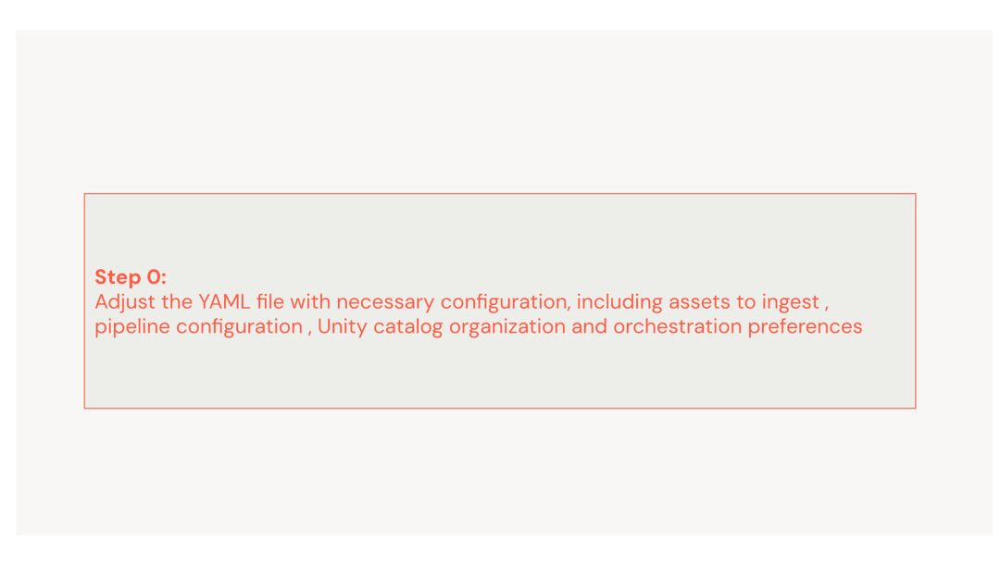
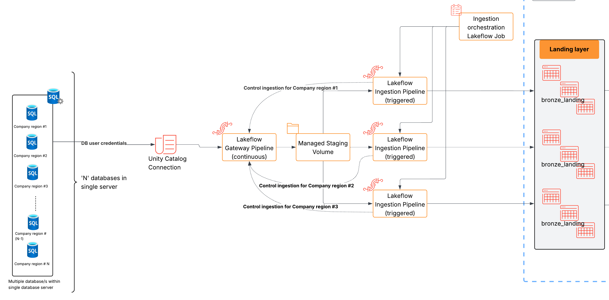

# Config-driven Terraform deployment of Lakeflow Connect connectors

This project is intended to deploy and scale out database connectors to the Databricks Lakehouse platform using infrastructure-as-code principles.
It is intended to be a database-agnostic, YAML-driven Terraform deployment for Databricks Lakeflow Connect that provides built-in validation and orchestration for deployments.

## Quick Visual Tour




## Key Features:
- **Database-agnostic**: Supports various Lakeflow Connect-supported databases by simply changing the `source_type` in the config.
    - Currently tested and verified connectors are:
        - SQL Server CDC ([Public docs](https://docs.databricks.com/aws/en/ingestion/lakeflow-connect/sql-server-pipeline))
        - PostgreSQL CDC ([Public docs](https://docs.databricks.com/aws/en/ingestion/lakeflow-connect/postgresql-pipeline))
        - Oracle (public docs to be added once in public preview)
        - MySQL ([Public docs](https://docs.databricks.com/aws/en/ingestion/lakeflow-connect/mysql-pipeline))
- **YAML-driven configuration**: Define connections, databases, schemas, tables, and schedules in a single configuration file
- **Flexible Unity Catalog mapping**: Configure where data lands with per-database catalog and schema customization
- **Flexible ingestion modes**: Choose between full schema ingestion or specific table selection per database
- **Automated orchestration**: Configurable job scheduling of the managed ingestion pipelines with support for multiple sync frequencies
- **Infrastructure-as-Code**: Fully automated deployment of gateway pipelines, ingestion pipelines, and orchestration jobs

**What gets deployed:**
- Lakeflow Connect gateway pipeline, using an existing Unity Catalog connection
- Ingestion pipelines for each database/schema combination, all routed through a single shared gateway
- Databricks jobs to orchestrate the ingestion workflows
- Optional: Event log tables for pipeline monitoring

## Overview

This project deploys a subset of the architecture shown below, focusing on infrastructure needed to run Lakeflow Connect data ingestion. Specifically, this project will deploy:

- The Lakeflow Connect Gateway pipeline, using a pre-existing Unity Catalog connection (**Note:** The connection itself is not created or managed by this project)
- Managed Ingestion pipelines for each configured database/schema/table combination, as defined in your YAML configuration
- Databricks Jobs to orchestrate and schedule the ingestion pipeline workflows
- (Optional) Event log tables used for pipeline monitoring and audit (created if configured in your YAML)





## Project Layout

```
lakeflow-connect-terraform/
├── config/                      # YAML configuration files
│   ├── lakeflow_dev.yml        # Active configuration
│   └── examples/                # Example configurations
│       ├── mysql.yml             # MySQL example
│       ├── oracle.yml            # Oracle example
│       ├── postgresql.yml        # PostgreSQL example
│       └── sqlserver.yml         # SQL Server example
├── infra/                       # Terraform root module
│   ├── backend.tf
│   ├── main.tf
│   ├── locals.tf
│   ├── outputs.tf
│   ├── provider.tf
│   ├── variables.tf
│   └── modules/
│       ├── gateway_pipeline/
│       ├── ingestion_pipeline/
│       ├── job/
│       ├── gateway_validation/
│       └── validate_catalog_and_schemas/
├── tools/                       # Validation scripts (optional)
│   ├── pydantic_validator.py    # Type-safe YAML validation (recommended)
│   └── validate_running_gateway.py
├── pyproject.toml              # Python dependencies for validation tools
└── README.md
```

## Pre-requisites

### Software Requirements
- **Terraform** >= 1.10
- **Databricks Terraform Provider** >= 1.104.0 (for PostgreSQL source_configurations support)
- **Databricks workspace** with Unity Catalog enabled
- **Python 3.10+** and **Poetry** (optional, for YAML validation tools)

### Databricks Setup

#### 1. Create Unity Catalog Connection
Create a Databricks Unity Catalog connection to your source database and specify it in your YAML config under `connection.name`.

Refer to Databricks documentation for your database type:
- [SQL Server Connection Setup](https://docs.databricks.com/aws/en/ingestion/lakeflow-connect/sql-server-overview)
- [PostgreSQL Connection Setup](https://docs.databricks.com/aws/en/ingestion/lakeflow-connect/postgresql-source-setup)
- [MySQL Connection Setup](https://docs.databricks.com/aws/en/ingestion/lakeflow-connect/mysql-privileges)
- **Oracle**: Create a Unity Catalog connection to your Oracle source. (public docs to be added once in public preview)

#### 2. Create Unity Catalog Structure
Based on your YAML configuration in the `unity_catalog` section, pre-create:

- **Catalogs**: Create catalog(s) specified in `global_uc_catalog` and `staging_uc_catalog` (if different)
- **Staging Schema**: Create the schema specified in `staging_schema` within the staging catalog
- **Ingestion Schemas**: Create schemas for ingestion pipelines in their target catalogs
  - Schema names will be: `{schema_prefix}{source_schema_name}{schema_suffix}`
  - Example: If source schema is `dbo` with prefix `dev_` → create schema `dev_dbo`
  - If no prefix/suffix specified, use the source schema name as-is

#### 3. Configure Source Database (Database-Specific)

**For PostgreSQL Sources:**
Pre-create replication slots and publications in the source database and specify in the YAML config ( see `config/examples/postgresql.yml`)

Refer to [PostgreSQL Replication Setup](https://docs.databricks.com/aws/en/ingestion/lakeflow-connect/postgresql-source-setup) for detailed instructions.

**For SQL Server Sources:**
Ensure CDC is enabled on the source database and tables. Refer to [SQL Server CDC Setup](https://docs.databricks.com/aws/en/ingestion/lakeflow-connect/sql-server-pipeline).

**For Oracle Sources:**
In your YAML config, set `connection.source_type: "ORACLE"` and provide `connection.connection_parameters.source_catalog` with your Oracle CDB (container database) name (e.g. `ORCLCDB`). See `config/examples/oracle.yml`. (public docs to be added once in public preview)

**For MySQL Sources:**
MySQL has no schema level (server → database → tables). In the YAML, list each database and under `schemas` use a placeholder name (e.g. `"<not applicable in MySQL>"`) and list tables by their **full MySQL table name**. Set `connection.source_type: "MYSQL"`. If you set `use_schema_ingestion: true`, it is ignored and ingestion uses the tables list; the Pydantic validator prints an info message when you run it. See `config/examples/mysql.yml`.

#### 4. Grant Permissions
Provide the user/SPN used for Terraform deployment with:

- `USE CONNECTION` on the Unity Catalog connection to the source database
- `USE CATALOG` on all catalogs specified in your YAML config
- `USE SCHEMA` and `CREATE TABLE` on all ingestion pipeline target schemas
- `USE SCHEMA`, `CREATE TABLE` and `CREATE VOLUME` on the staging schema
  - Note: `CREATE TABLE` allows creation of event log tables if enabled
- Access to cluster policy for spinning up gateway pipeline compute ([Policy Documentation](https://docs.databricks.com/aws/en/admin/clusters/policy-definition))
  - Specify the policy name in your YAML config under `gateway_pipeline_cluster_policy_name`

### Assumptions
1. **Unity Catalog Resources**: All Unity Catalog catalogs and schemas specified in the YAML configuration must already exist. This project validates their existence but does not create them.
2. **Database Permissions**: The database replication user used with the Unity Catalog connection must have all necessary permissions on the source database.
3. **Source Database Configuration**: For PostgreSQL, replication slots and publications must be pre-created. For SQL Server, CDC must be enabled.

## Installation

### Step 1: Clone and Configure

```bash
# Clone the repository
git clone <your-repo-url>
cd lakeflow-connect-terraform

# Copy an example configuration and customize for your environment
# For PostgreSQL:
cp config/examples/postgresql.yml config/lakeflow_<your_env>.yml

# For SQL Server:
cp config/examples/sqlserver.yml config/lakeflow_<your_env>.yml

# For Oracle:
cp config/examples/oracle.yml config/lakeflow_<your_env>.yml

# For MySQL:
cp config/examples/mysql.yml config/lakeflow_<your_env>.yml

# Edit the YAML file with your environment details
```

### Step 2: (Optional) Set Up Python Validation Tools

The Python tools provide **type-safe YAML validation** using Pydantic **before** Terraform deployment. This catches configuration errors early with detailed error messages. **Note**: Terraform itself does not require Poetry. It reads YAML directly using the built-in `yamldecode()` function.

```bash
# Install Poetry (if not already installed)
pip install poetry

# Install project dependencies (includes Pydantic, croniter, etc.)
poetry install

# Validate your configuration before deploying
poetry run python tools/pydantic_validator.py config/lakeflow_<your_env>.yml
```

**What gets validated:**
- ✅ **Type safety**: Boolean values must be `true/false`, not strings
- ✅ **Source-specific config**: PostgreSQL requires `replication_slot` and `publication`; Oracle requires `connection_parameters.source_catalog` (CDB name)
- ✅ **Cross-references**: Database names in schedules must exist
- ✅ **Unity Catalog logic**: Validates catalog configuration rules
- ✅ **Cron expressions**: Validates Quartz cron syntax
- ✅ **Schema naming**: Validates prefix/suffix contain valid characters
- ✅ **Table requirements**: Ensures tables are specified when needed

After validation passes, proceed with Terraform deployment (no Poetry needed).

### Step 3: Configure Authentication

Set up authentication for Databricks workspace Terraform provider:

**Option A: Personal Login (Development)**
```bash
# For Azure
az login
export DATABRICKS_HOST="https://adb-xxxxx.azuredatabricks.net"
export DATABRICKS_AUTH_TYPE="azure-cli"
```

**Option B: Service Principal**
```bash
# Create profile in ~/.databrickscfg
cat >> ~/.databrickscfg << EOF
[production]
host                = https://adb-<workspace_id>.<num>.azuredatabricks.net/
azure_tenant_id     = <tenant_id>
azure_client_id     = <client_id>
azure_client_secret = <client_secret>
auth_type           = azure-client-secret
EOF

# Set environment variable
export DATABRICKS_CONFIG_PROFILE=production
```

### Step 4: Configure Terraform Backend

**Option A: Local Backend (Default - For Single User)**

The project is configured with local backend by default. State is stored at `infra/terraform.tfstate`.

```bash
cd infra
terraform init
terraform validate
```

**Option B: Remote Backend (Recommended for Teams)**

For team collaboration, use a remote backend like Azure Storage. Update `infra/backend.tf`:

```hcl
terraform {
  backend "azurerm" {
    resource_group_name  = "terraform-state-rg"
    storage_account_name = "tfstatelakeflow"
    container_name       = "tfstate"
    key                  = "lakeflow-connect.tfstate"
  }
}
```

Then initialize with the backend configuration:
```bash
cd infra

# Set Azure credentials
export ARM_SUBSCRIPTION_ID="<subscription_id>"
export ARM_TENANT_ID="<tenant_id>"
export ARM_CLIENT_ID="<client_id>"
export ARM_CLIENT_SECRET="<client_secret>"

# Initialize with remote backend
terraform init -reconfigure
terraform validate
```

Other Remote Backend Options can be used. See [Terraform Backend Documentation](https://developer.hashicorp.com/terraform/language/settings/backends) for more options.

### Step 5: Deploy Infrastructure

Run Terraform via `poetry run` so that the gateway validation step (which runs a Python script using the Databricks SDK) has access to the project's Python dependencies.

```bash
# Plan deployment (review changes)
poetry run terraform plan --var yaml_config_path=../config/lakeflow_<env>.yml

# Apply deployment
poetry run terraform apply --var yaml_config_path=../config/lakeflow_<env>.yml
```

**Note:** While `terraform plan` does not require `poetry run` (since the gateway validation Python script is executed only during `apply`), we recommend using `poetry run` for both `plan` and `apply` to provide a consistent workflow and environment.

## YAML Configuration

See `config/examples/` for complete example configurations ([MySQL](config/examples/mysql.yml), [Oracle](config/examples/oracle.yml), [PostgreSQL](config/examples/postgresql.yml), [SQL Server](config/examples/sqlserver.yml)). The configuration is fully YAML-driven with the following main sections:

### Connection
```yaml
connection:
  name: "my_uc_connection"
  source_type: "POSTGRESQL"  # POSTGRESQL, SQLSERVER, MYSQL, ORACLE

# Oracle only: required when source_type is ORACLE (CDB name for gateway)
# connection_parameters:
#   source_catalog: "ORCLCDB"
```

### Unity Catalog Configuration
```yaml
unity_catalog:
  global_uc_catalog: "my_catalog"      # Required: Default catalog for ingestion pipelines
  staging_uc_catalog: "staging_cat"    # Optional: Catalog for gateway staging (defaults to global)
  staging_schema: "lf_staging"         # Optional: Schema for gateway staging (defaults to {app_name}_lf_staging)
```

- `global_uc_catalog`: Default catalog where ingestion pipeline tables land (required)
- `staging_uc_catalog`: Catalog for gateway pipeline staging assets (optional, defaults to `global_uc_catalog`)
- `staging_schema`: Schema name for gateway staging assets (optional, defaults to `{app_name}_lf_staging`)

### Databases
```yaml
databases:
  - name: my_database
    # Optional: Override global catalog for this database
    uc_catalog: "custom_catalog"
    
    # Optional: Customize schema names
    schema_prefix: "dev_"      # Results in: dev_<schema_name>
    schema_suffix: "_raw"      # Results in: <schema_name>_raw
    
    # PostgreSQL only: Replication configuration
    replication_slot: "dbx_slot_mydb"
    publication: "dbx_pub_mydb"
    
    schemas:
      - name: public
        use_schema_ingestion: true  # Ingest all tables
      - name: app_schema
        use_schema_ingestion: false  # Ingest specific tables only
        tables:
          - source_table: users
          - source_table: orders
          # Optional per-table overrides (default to schema/database-level catalog and schema):
          - source_table: orders_archive
            destination_table: orders_archive_v2  # optional
            destination_catalog: other_catalog   # optional
            destination_schema: other_schema    # optional
```

- Per-database `uc_catalog`: Override global catalog for specific database (optional)
- Per-database `schema_prefix` and `schema_suffix`: Customize destination schema names (optional)
- Per-database `replication_slot` and `publication`: PostgreSQL replication configuration (PostgreSQL only)
- Schemas and tables to ingest with granular control
- Per-table destination overrides: For table-level ingestion (`use_schema_ingestion: false`), each table can optionally specify `destination_table`, `destination_catalog`, and `destination_schema`. When set, they override the pipeline default (from database/schema config). Catalogs and schemas used by per-table overrides are validated and must exist in Unity Catalog.

### Event Logs
```yaml
event_log:
  to_table: true  # Enable/disable materialization of event logs to Delta tables
```

### Job Orchestration
```yaml
job:
  common_job_for_all_pipelines: false
  common_schedule:
    quartz_cron_expression: "0 */30 * * * ?"
    timezone_id: "UTC"
  
  # Per-database schedules (when common_job_for_all_pipelines is false)
  per_database_schedules:
    - name: "frequent_sync"
      applies_to: ["db1", "db2"]
      schedule:
        quartz_cron_expression: "0 */15 * * * ?"
        timezone_id: "UTC"
```

Supports two scheduling modes:
1. **Common job for all pipelines** (`common_job_for_all_pipelines: true`): Single job runs all database ingestion pipelines on the same schedule
2. **Per-database scheduling** (`common_job_for_all_pipelines: false`): Separate jobs per schedule group, allowing different databases to sync at different frequencies

## How does it compare to other deployment options?

| Feature | This Project (Terraform) | Databricks CLI | DABS | REST API | UI |
|---------|-------------------------|----------------|------|----------|-----|
| **Infrastructure-as-Code** | ✅ Native | ⚠️ Limited | ✅ Yes | ❌ No | ❌ No |
| **Version Control** | ✅ Git-native | ⚠️ Manual | ✅ Git-native | ❌ Manual | ❌ Manual |
| **Multi-environment** | ✅ Built-in | ⚠️ Manual | ✅ Built-in | ⚠️ Manual | ❌ Manual |
| **State Management** | ✅ Native | ❌ None | ⚠️ Limited | ❌ None | ❌ None |
| **YAML-driven** | ✅ Yes | ❌ No | ✅ Yes | ❌ No | ❌ No |
| **Validation** | ✅ Pre-deploy | ❌ No | ⚠️ Limited | ❌ No | ⚠️ Post-deploy |
| **Team Collaboration** | ✅ Excellent | ⚠️ Manual | ✅ Good | ❌ Poor | ❌ Poor |
| **Learning Curve** | ⚠️ Moderate | ✅ Easy | ⚠️ Moderate | ⚠️ Complex | ✅ Easy |
| **Automation-friendly** | ✅ Excellent | ✅ Good | ✅ Good | ✅ Excellent | ❌ Poor |

**When to use Terraform (this project):**
- Managing multiple environments (dev, staging, prod)
- Team collaboration with state management
- Complex configurations with many pipelines
- CI/CD automation requirements
- Need for validation before deployment

**When to use alternatives:**
- **UI**: Quick one-off deployments, learning/exploration
- **CLI**: Simple scripts, single-pipeline deployments
- **DABS**: Databricks-native workflows with asset bundles
- **API**: Custom integrations, programmatic control

## How to get help

Databricks support doesn't cover this content. For questions or bugs, please open a GitHub issue and the team will help on a best effort basis.

## Future Enhancements

- Pre-commit hooks for YAML validation
- Pydantic-based schema validation
- Automated CI/CD pipeline examples
- Metadata export for downstream applications
- Cost estimation based on configuration
- Multi-region deployment support

## License

© 2025 Databricks, Inc. All rights reserved. The source in this notebook is provided subject to the [Databricks License](https://databricks.com/db-license-source). All included or referenced third party libraries are subject to the licenses set forth below.

| library                                | description             | license    | source                                              |
|----------------------------------------|-------------------------|------------|-----------------------------------------------------|
| terraform-provider-databricks          | Databricks provider     | Apache 2.0 | https://github.com/databricks/terraform-provider-databricks |
